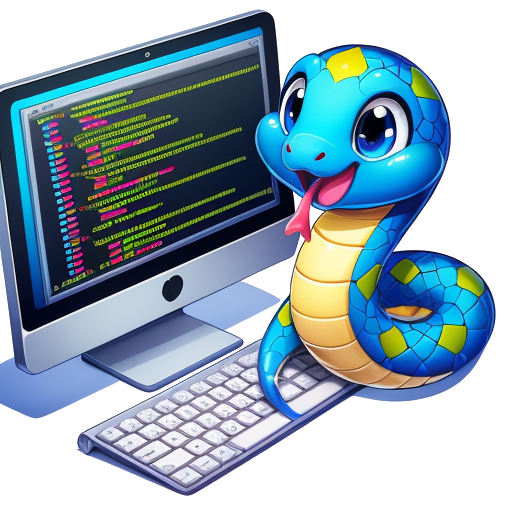

# Python 编程

目前还只是草稿......

阅读页面： <https://py.qizhen.xyz>。手机屏阅读的时候，查看全书目录需要点击一下页面左上角 3 根横线的那个按钮。需要搜索特定内容可以使用页面右上角的搜索框。有任何问题，欢迎留言讨论。

全书分五个主要部分：

* Python 编程基础： 讲解了 Python 语言的核心语法和基础用法。通过这一部分的学习，可以掌握建立一个简单的小型程序所需的基本知识，如变量定义、基本数据类型、控制流语句等。
* 函数式编程： 介绍了函数式编程的概念和在 Python 中的应用。这一部分着重于高阶函数、闭包、装饰器等概念，通过函数式编程的思想，讲解如何编写更加简洁、高效的 Python 代码。
* 面向对象编程： 为了帮助理解和应用更复杂的程序设计模式，本部分深入探讨了面向对象编程的方法。内容涵盖类和对象的定义、继承、多态、封装等面向对象的基本原则，以及如何在 Python 中实现它们。
* 数据结构与算法： 虽然数据结构和算法是与具体编程语言无关的通用概念，但实现它们的代码却是最好的参考范例。这部分内容不仅覆盖了数据结构如列表、栈、队列、集合和字典等，还包括了搜索、排序等基础算法，目的在于帮助读者理解它们的工作原理并学会如何在实际中灵活运用。
* Python在特定领域的应用： Python 的应用实在是太广泛了，比如数据可视化、数据分析、网络编程、Web开发等。针对每个具体应用的介绍都显得非常零散，于是把它们都收录在“无所不能”的最后一部分。

书中所采用的示例程序，除了最简单的演示基本概念的简单示例之外，其它大多取材自面试编程题目。

## 为什么要写一本 Python 的书？

毕竟，Python 的书太多了。而且，现在大家都看视频了，谁还看书呢？

在中国，我属于比较早就开始接触编程的了。上大学之前，我曾简单接触过 BASIC 语言，虽然连入门都不能算。真正开始系统学习编程还是在上大学之后，起步是从 Pascal 语言开始的。学生时代，我还学习了汇编、C、Scheme、MATLAB 等语言。步入职场后，主要使用的语言却都是学校里不曾教授过的，包括 C++、C#、LabVIEW、Java、PHP、JavaScript、Python 等。在学校时，教科书是我们的主要学习资源。工作初期，要学习一门新语言，我通常也会翻阅书籍。那时候，找到一本好书至关重要。记得当年，《Effective C++》 是我们学习 C++ 时的必读之作，而 《Design Patterns》 则指导了我们学习 Java 的道路。相比之下，我学习 JavaScript 和 Python 的时期稍晚，那时的学习方式已经革新了，搜索引擎成了我的主要学习工具。说来惭愧，我至今一本 JS 和 Python 的书都还没看过，所有相关知识都是从 Google 上搜到的。

虽然书籍可能不再是我们获取知识的唯一途径，但从我的经验来看，写作，或者说，记笔记，依然是学习过程中不可或缺的一环。亲手写过的知识，与仅仅阅读过的知识，掌握程度会截然不同。再者，我是个有点懒惰的人，如果没有外在目标驱动，我往往不太乐于主动学习。发布一本书，与人分享，这成为了我前进的一个强大动力。

今天，我们又一次站在了技术变革的门槛上。大型语言模型很可能将取代搜索引擎，成为未来获取学习资料的重要途径。深入体验大型语言模型为学习和写作带来的新机遇，也是我撰写此书的初衷之一。当我整理完书中的核心内容后，我将分享我对大预言模型的体验和感悟，作为整个写作过程的一个总结。

## 关于 Python

在我使用过的众多编程语言中，Python 因其易学易用脱颖而出。它可以让编程者专注于逻辑功能的实现，而不必纠结于语言细节。我还记得初次使用 C++ 开发时的挣扎，大量的时间花在了解决内存泄露和野指针等底层问题上，这无疑拖慢了开发进度。相比之下，Python 优雅地将编程语言的复杂性隐藏在了背后，为编程者提供了最简单直接的编程方式。这一特点，使得许多非计算机专业的人士也能够轻松上手 Python 编程。我甚至开始教我的儿子使用 Python，就是为了验证即便没有深厚的数学基础的孩子，也能够愉快地编程。

Python的 另一大魅力，在于其强大而包容的开源社区。不论需要什么功能，几乎都可以找到相应的库直接使用。与之相比，C/C++ 已经被广泛使用几十年了，却还是很难寻找到所需的资源。这些热心的开发者们不仅提供了大量的学习资源，同时还开发和维护了无数的库和框架，正在挤占其它语言的领地，我注意到很多学校里曾经使用 MATLAB 开发的教学程序，但后来也都被 Python 取代了。

