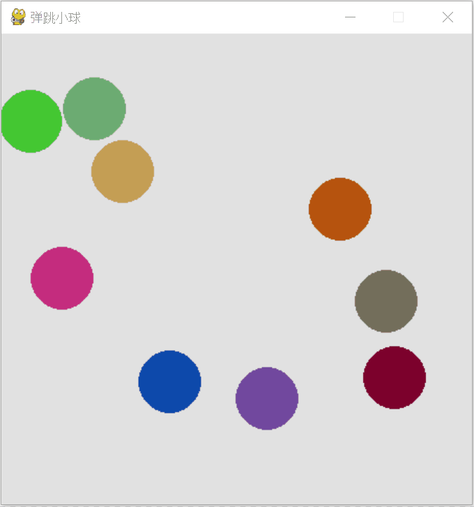

# 简单动画

这一节的目标是在屏幕上绘制多个可以移动的刚性小球，它们之间会碰撞反弹。用于演示初中物理中讲解的动量守恒原理。Python 中有很多库都可以用来实现动画，比如上文介绍的 Tkinter。这一节着重介绍一下 Pygame 库。

## Pygame 库

Pygame 顾名思义，是专为电子游戏设计的。它提供了创建游戏所需的图形和声音库。它允许用户快速地开发游戏，而不需要从头开始编写底层的代码。Pygame 基于 SDL（Simple DirectMedia Layer），这是一种跨平台的多媒体库，用于处理视频、声音、输入设备、和CD-ROM等。

Pygame 不是 Python 自带的，需要额外安装，可以可以通过 Python 的包管理器 pip 来安装 Pygame：

```bash
pip install pygame
```

一旦安装好了，就可以导入 pygame 模块并开始编写游戏代码了。我们使用一个简易的小游戏来介绍一下如何使用 pygame。

## 简单游戏

假设，我们要编写一个简单的小游戏：屏幕上，有一个小球随机落下，频幕下方，用户可以控制一个水平移动的木板。如果木板接住小球，小球就会弹起，否则小球落下，游戏结束。下面是这个游戏的程序：

```python
import pygame
import random

# 初始化 pygame
pygame.init()

# 设置屏幕尺寸
screen_width = 600
screen_height = 400
screen = pygame.display.set_mode((screen_width, screen_height))

# 颜色定义
PADDLE_COLOR = (100, 200, 100)
SCREEN_COLOR = (10, 10, 10)
BALL_COLOR = (200, 30, 30)

# 游戏变量
ball_radius = 15
ball_speed = 2
paddle_width = 100
paddle_height = 20
paddle_speed = 5
paddle = pygame.Rect(screen_width // 2 - paddle_width // 2, screen_height - 40, paddle_width, paddle_height)

# 创建一个球的位置和速度
ball = pygame.Rect(random.randint(ball_radius, screen_width - ball_radius), 0, ball_radius * 2, ball_radius * 2)
ball_dx = random.choice([-1, 1])
ball_dy = ball_speed

# 游戏循环标志
running = True

# 游戏主循环
while running:
    for event in pygame.event.get():
        if event.type == pygame.QUIT:
            running = False

    # 键盘操作
    keys = pygame.key.get_pressed()
    if keys[pygame.K_LEFT]:
        paddle.x -= paddle_speed
        if paddle.left < 0:
            paddle.left = 0
    if keys[pygame.K_RIGHT]:
        paddle.x += paddle_speed
        if paddle.right > screen_width:
            paddle.right = screen_width

    # 移动球
    ball.x += ball_dx
    ball.y += ball_dy

    # 球碰撞检测
    if ball.left <= 0 or ball.right >= screen_width:
        ball_dx *= -1
    if ball.top <= 0:
        ball_dy *= -1
    if ball.colliderect(paddle) and ball_dy > 0:
        ball_dy *= -1

    # 检查球是否掉出屏幕底部
    if ball.bottom >= screen_height:
        print("游戏结束！")
        running = False

    # 绘制
    screen.fill(SCREEN_COLOR)  # 使用黑色填充屏幕
    pygame.draw.ellipse(screen, BALL_COLOR, ball)  # 绘制红色的球
    pygame.draw.rect(screen, PADDLE_COLOR, paddle)  # 绘制黄绿色的木板

    # 更新屏幕显示
    pygame.display.flip()
    pygame.time.delay(10)

# 退出游戏
pygame.quit()
```

在上面的程序中，导入 pygame 模块后，先要调用 init() 方法对其初始化。然后使用 display.set_mode() 方法，设置游戏窗口的尺寸。

程序设定了一些游戏中的常数和变量，比如球的颜色，运动速度等。其中 pygame.Rect 是一个类，它用来存储和操作矩形区域的坐标和尺寸。这个类在游戏开发中非常有用，因为它提供了一种简便的方式来跟踪游戏元素（如角色、障碍物、按钮等）的位置和大小，并且可以轻松地用来检测碰撞和进行界面布局。我们为游戏中的两个物体，球和木板都定义为了 Ract 的对象。

pygame 提供了绘制简单形状的函数，比如绘制圆球，可以使用 draw.ellipse() 方法；绘制矩形木板，可以使用 draw.rect() 方法。pygame 在绘制图形时，并不会直接绘制到屏幕上，因为这样会影响动画效果。它首先把所有需要绘制的图形都绘制在缓冲区里，当调用 display.flip() 方法时，再把已经绘制好的图案显示到屏幕上，这样就不容易出现闪烁、残影等问题了。

在程序运行的主循环中，一直在检测用户是否有按下左右箭头按键，如果有，则会相应改变木板的位置。同时，程序也在一直监视小球的位置，如果小球与墙壁或木板发生碰撞，则改变它的速度，让它反弹。


## 生成随机数

多数程序不需要有随机因素，它们需要的是准确的结果。但是随机对于游戏确非常重要。用户不会喜欢每次打开游戏，看到的过程都是一模一样的，他们需要一些不可预期的新奇感。这时候，随机数就派上用场了。

在Python中生成随机数的主要方式是通过内置的random模块，这个模块提供了多种生成随机数的函数。下面是一些最常用的功能：
* random.random(): 返回一个0到1之间的随机浮点数，其中包括0但不包括1。
* random.uniform(a, b): 返回一个指定范围内的随机浮点数，范围由参数a和b定义，其中包括a但不包括b。
* random.randint(a, b): 返回一个指定范围内的随机整数，范围由参数a和b定义，包括两端的边界值。
* random.choice(sequence): 从一个非空序列中返回一个随机元素。
* random.shuffle(sequence): 将序列随机打乱位置。
* random.sample(population, k): 从总体序列或集合中选择k个唯一的随机元素。

```python
import random

# 定义一个列表
my_list = ['apple', 'banana', 'cherry', 'date', 'elderberry', 'fig', 'grape']

# 使用random.shuffle打乱列表
random.shuffle(my_list)

# 打印打乱后的列表
print("Shuffled list:", my_list)

# 使用 random.sample 随机选择 3 个元素
selected_items = random.sample(my_list, 3)

# 打印选择的元素
print("Selected items:", selected_items)
```

运行上面的程序，每次都会看到不一样的结果。


### 多个球运动

回到本节最初的那个问题：“绘制多个可以移动的刚性小球，它们之间会碰撞反弹。”由于有多个球，我们可以定义一个球的类，包含所有球的属性和方法，然后让每个球都是一个实例。比如：

```python
class Ball:
    def __init__(self):
        # 初始化球的属性和状态

    def hit_boundary_check(self):
        # 碰撞检查

    def update(self):
        # 更新球的各种属性

    def draw(self):
        # 在屏幕上绘制
```

另一个麻烦的地方是，两球碰撞后的速度如何改变。它们的速度大小方向，碰撞位置都可能不同。如果只采用简单规则，向上面示例那样，球的运动看起来就会特别不真实。所以，在程序里，我们定义了一些向量运算，它们的目的是当两球相撞时，把两个球的速度都分解为两个向量，一个是沿着两球连线方向的运动分量，另一个是垂直与两球连线方向的运动分量。假设所有球的质量相同，那么按照动量守恒定理，两个球沿着连线方向上的运动分量应该互换，而垂直于连线方向上的运动分量保持不变。在做完上述计算后，在把每个球的两部分运动分量转换成沿着 x 和 y 坐标轴上的分量，就可以继续了。

这个程序如下：

```python
import pygame
import sys
import math
import numpy as np
import random

# 初始化 Pygame
pygame.init()

# 设置显示屏幕的大小
SCREEN_WIDTH, SCREEN_HEIGHT = 450, 450
screen = pygame.display.set_mode((SCREEN_WIDTH, SCREEN_HEIGHT))
pygame.display.set_caption("弹跳小球")  # 窗口标题

# 定义球类
class Ball:
    def __init__(self, screen, position, speed):
        self.screen = screen  # 绘图表面
        self.position, self.speed = position, speed  # 球的初始位置和速度
        self.radius = 30  # 球的半径
        # 球的颜色，随机生成
        self.color = (random.uniform(0, 200), random.uniform(0, 200), random.uniform(0, 200))

    # 检查球是否撞到边界
    def hit_boundary_check(self):
        # 如果球撞到左右边界
        if self.position[0] + self.radius >= SCREEN_WIDTH or self.position[0] - self.radius <= 0:
            self.speed[0] = -self.speed[0]
        # 如果球撞到上下边界
        if self.position[1] + self.radius >= SCREEN_HEIGHT or self.position[1] - self.radius <= 0:
            self.speed[1] = -self.speed[1]

    # 更新球的位置
    def update(self):
        self.hit_boundary_check()  # 检查球是否撞到边界
        self.position[0] += self.speed[0]  # 横向移动
        self.position[1] += self.speed[1]  # 纵向移动

    # 绘制球到屏幕上
    def draw(self):
        pygame.draw.circle(screen, self.color, self.position, self.radius)  # 在屏幕上绘制球


# 向量投影函数
def vector_projection(a, b):
    a = np.array(a)
    b = np.array(b)

    # 计算 a 和 b 的点积
    dot_product = np.dot(a, b)
    # 计算 b 的平方范数
    b_norm_squared = np.linalg.norm(b) ** 2
    # 计算 a 在 b 上的投影
    projection = (dot_product / b_norm_squared) * b

    return projection.tolist()


# 计算两点之间的方向向量
def vector_along_2_points(a, b):
    return [b[0] - a[0], b[1] - a[1]]


# 计算两点构成的方向向量的垂直向量
def vector_perpendicular_2_points(a, b):
    direction_vector = vector_along_2_points(a, b)
    # 返回方向向量的垂直向量
    return [-direction_vector[1], direction_vector[0]]


# 计算两点之间的距离
def distance(a, b):
    x1, y1 = a
    x2, y2 = b
    return math.sqrt((x2 - x1)**2 + (y2 - y1)**2)


# 向量加法
def vector_plus(a, b):
    return [b[0] + a[0], b[1] + a[1]]


def hit_others_check(a, b):
    # 如果两个球之间的距离小于它们半径之和，说明它们发生了碰撞，需要改变两球速度
    if distance(a.position, b.position) <= a.radius + b.radius:
        direction_vector = vector_along_2_points(a.position, b.position)
        perpendic_vector = vector_perpendicular_2_points(a.position, b.position)
        speed_a_direction = vector_projection(a.speed, direction_vector)
        speed_b_direction = vector_projection(b.speed, direction_vector)
        speed_a_perpendic = vector_projection(a.speed, perpendic_vector)
        speed_b_perpendic = vector_projection(b.speed, perpendic_vector)
        new_speed_a = vector_plus(speed_b_direction, speed_a_perpendic)
        new_speed_b = vector_plus(speed_a_direction, speed_b_perpendic)

        if distance(vector_plus(a.position, new_speed_a), vector_plus(b.position, new_speed_b)) >= distance(a.position, b.position):
            a.speed = new_speed_a
            b.speed = new_speed_b

balls = []  # 创建9个球的实例并设置初始位置和速度
balls.append(Ball(screen, [100, 100], [3, 0]))
balls.append(Ball(screen, [100, 200], [-2, -2]))
balls.append(Ball(screen, [100, 300], [0, 3]))
balls.append(Ball(screen, [200, 100], [-1, -2]))
balls.append(Ball(screen, [200, 200], [-2, -1]))
balls.append(Ball(screen, [200, 300], [0, 3]))
balls.append(Ball(screen, [300, 100], [1, 2]))
balls.append(Ball(screen, [300, 200], [4, 4]))
balls.append(Ball(screen, [300, 300], [2, 1]))

number_balls = len(balls)

# 主游戏循环
while True:
    for event in pygame.event.get():
        # 如果点击关闭窗口则退出游戏
        if event.type == pygame.QUIT:
            pygame.quit()
            sys.exit()

    # 更新所有球的位置
    for i in range(number_balls):
        for j in range(i + 1, number_balls):
            # 检查球之间的碰撞并更新速度
            hit_others_check(balls[i], balls[j])

    for i in range(number_balls):
        balls[i].update()

    # 用白色填充整个屏幕背景
    screen.fill((225, 225, 225))

    # 绘制所有的球
    for i in range(number_balls):
        balls[i].draw()

    # 刷新屏幕显示
    pygame.display.flip()

    # 控制帧率
    pygame.time.Clock().tick(30)
```

程序运行结果大致如下：

