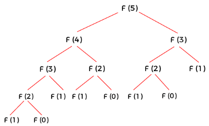

# 递归

递归是一种常见的算法，指函数直接或间接地调用自身。递归可以解决的问题通常可以被分解为相似的子问题。这些子问题的结构与原始问题相似，但规模较小。
如果大家还记得学习数学的时候有个归纳法，递归可以被看作是把归纳法写成程序。递归的策略是把一个大的复杂的问题转换为一个小的和原问题相似的问题，再进一步把问题拆成更小的问题，最终解决整个问题。理论上，任何需要使用递归调用的地方，都可以用循环结构来代替。但是在某些情况下，使用递归调用的确可以大大简化程序代码的复杂度，有助于缩短编程时间、提高程序可读性。所以，学会如何实现递归还是很有用的。

## 计算阶乘

下面看一个最简单的例子：计算阶乘。计算某个正整数的阶乘就是用那个数去乘所有比它小的正整数。比如 3 的阶乘写作 `3! = 3*2*1`；类似的 `6! = 6*5*4*3*2*1`。如果用循环来计算 n 的阶乘，就是把所有小于 n 的正整数乘起来就行了：

```python
def factorial(n):
    result = 1
    for i in range(1, n+1):
        result *= i
    return result

print(factorial(5))  # 输出：120
```

但是我们还可以换一种方法来考虑如何计算阶乘：我们不是直接从原始的数据开始计算，而是用归纳的方法，一步一步的来简化问题，比如 6 的阶乘，它可以通过先计算 5 的阶乘，再把结果乘以 6。用公式来描述就是 `0! = 1, n! = n * (n-1)!   |（n≧1）`，或者写成函数的形式为：`F(0) = 1, F(n) = n * F(n-1)   |（n≧1）`。数学归纳法中一定要有一个基本情况，对于阶乘的问题，基本情况是 0，0 的阶乘等于 1，这是人为定义出来的。有的读者可能已经注意到了，用归纳法表示的阶乘与直接计算阶乘不是完全一模一样，归纳法把阶乘计算推广到了所有非负整数，而直接计算，只能计算正整数的阶乘。这算是归纳法的一个小优势吧。

以下是使用递归实现的阶乘函数：

```python
def factorial(n):
    # 基线条件
    if n == 0:
        return 1
    # 递归条件
    else:
        return n * factorial(n-1)

print(factorial(5))  # 输出：120
```

设计递归算法的时候，一定要明确两个条件：
* 基线条件（Base Case）：每个递归函数都需要有一个或多个基线条件。当满足基线条件时，函数将直接返回一个值而不再递归调用自身。
* 递归条件（Recursive Case）：这是函数将继续调用自己的部分，通常在处理规模减小或更接近基线条件的问题时。

在上面例子中，当 n 为 0 时，函数直接返回 1 （基线条件）。否则，函数会递归地调用自己来计算n-1的阶乘，并将结果与n相乘。

## 计算斐波纳契数列

阶乘这个问题过于简单，还不能完全体现递归的优势。我们可以再考虑一个稍微更复杂一点的问题：斐波纳契数列。
这个问题是意大利人斐波那契在描述兔子繁殖的数量时用到的:
* 第一个月初有一对刚诞生的兔子
* 第二个月之后（第三个月初）它们可以生育
* 每月每对可生育的兔子会诞生下一对新兔子
* 兔子永不死去

每个月兔子的总数量用数学归纳法来描述就是：
* `F(0) = 0`
* `F(1) = 1`
* `F(n) = F(n-1) + F(n-2)   |（n≧2）`

这个问题的数学归纳法公式简洁明了，非常适合用递归算法来解决。首先，还先编写归纳法的基本情况，也就是递归的结束条件，当输入为 0 和 1 时，分别输出 0 和 1：

```python
def fibonacci(n):
    if n <= 1:
        return n
    else:
        return fibonacci(n - 1) + fibonacci(n - 2)

# 测试
n = 10
for i in range(n):
    print(fibonacci(i), end=" ")
```

运行上面的代码将打印斐波纳契数列的前10个数字：0, 1, 1, 2, 3, 5, 8, 13, 21, 34。 读者可以用一个不大于 20 的输入数据试验一下，看结果是否正确。但是千万不要尝试太大的输入数据（大于 30），因为上面这个算法，它的功能上虽然正确，效率上却存在巨大缺陷，当输入数据大于 30 的时候，它的运算会非常非常耗时。我们分析一下上图程序的运行过程，假如输入数值为 20，程序会分别调用自己两次：
* 一次去计算 19 的斐波纳契数，在其内部，程序又会分两次递归调用，一次去计算 18 的斐波纳契数……；
* 另一次去计算 18 的斐波纳契数，可是 18 的斐波纳契数已经在上面那个递归调用的分支里计算过了啊，现在又要重复计算一遍！

我们可以把上述的调用关系用一棵二叉树来表示：



这样的算法，输入值每增加 1，程序的计算量就要翻倍。也就是程序的运算量与输入数据的大小呈指数关系，时间复杂度： $O(2^n)$。这是编写递归程序时比较容易出现的一个效率问题：同样的计算，在不同的地方被运行了很多次。

下面我们讨论几条解决这个效率问题的思路。

#### 带缓存的递归

既然低效率是由于同样的计算被运行多次引起的，那么一个最直接简单的解决方案是：把每次运算的结果记录下来，如果之后再遇到同样的计算，就直接把记录的结果拿来用，不再重新计算了。具体的实现方法可以是：在程序里设置一段缓存，每次进入递归函数时先查看一下，需要计算的数据是不是已经有结果记录在缓存里了，如果有，那么直接从缓存中拿出之前记录的结果；如果缓存中没有想要的结果，再进行计算，然后把计算的结果记录在缓存里。因为程序在计算每一个值之前，都先到缓存里查一下，这就避免了重复计算。

缓存可以使用任何数据结构来构建，比如我们可以把计算结果暂时保存在一个字典里。下图是添加了缓存的计算斐波纳契数的程序：

```python
cache = {}

def fibonacci(n):
    if n in cache:
        return cache[n]
    if n <= 1:
        return n
    else:
        result =  fibonacci(n - 1) + fibonacci(n - 2)
        cache[n] = result
        return result

# 测试
n = 38
for i in range(n):
    print(fibonacci(i), end=" ")
```

它与不带缓存的基本递归算法是完全一致的。唯一的改变在于，在真正开始计算前，先查看要计算的数据是否已经在缓存中了。如果是，则直接返回从缓存中取回结果。如果缓存中没有，那么进行递归计算，但是在输出结果之前，先把运算的结果插入到缓存里。

在效率改进之后，程序已经可以计算较大数值的斐波纳契数了。

#### 避免树形递归

另一个提高效率的思路是：保证每计算一个步，只递归调用本身一次，这样也可以避免重复计算。具体方法如下：在计算第 n 步的时候，我们需要把第 n-1 步和第 n-2 的结果加起来。但是第 n-2 的结果在计算第 n-1 结果时也用到了。就是说，每一个结果会被后面的两次计算用到，所以只要把这个结果作为函数的输出，传递给后面两次运算就好了。

使用这个思路来编写程序，程序有两个输入 a 和 b 分别记录前两次的运算结果。当输入 n 为 0 时，也就是递归的结束条件，把 b 的值返回：

```python
def fibonacci(n, a, b):
    if n <= 0:
        return b
    else:
        return fibonacci(n - 1, a + b, a)

# 测试
n = 10
for i in range(n):
    print(fibonacci(i, 1, 0), end=" ")
```

使用这种递归算法，优点是提高了运算效率，缺点是它的算法并不是直接对应与斐波纳契数的数学归纳法的描述，理解起来不那么直观。程序员有时候要在程序的运行效率和可读性之间做取舍。

#### 斐波纳契数的计算公式

本节内容使用了斐波纳契数作为讲解递归算法的一个示例。但是，如果我们只考虑斐波纳契数本身的话，它并非必须使用递归来计算。比如，也可以使用循环进行计算：求 n 的斐波纳契数，可以从小到大计算，先算出 0 的斐波纳契数，再计算 1 的斐波纳契数，再计算 2 的斐波纳契数…… 循环迭代 n 次，得到 n 的斐波纳契数。但是，最高效的算法是使用斐波纳契数的公式直接计算，公式是：

$F(n) = \frac{{\varphi^n - (1 - \varphi)^n}}{{\sqrt{5}}}$

其中，$\varphi$ 是黄金分割比，其值为 $\frac{{1 + \sqrt{5}}}{{2}}$。

```python
import math

def fibonacci(n):
    phi = (1 + math.sqrt(5)) / 2
    fib_n = round((phi**n - (1 - phi)**n) / math.sqrt(5))
    return fib_n

n = 10
for i in range(n):
    print(fibonacci(i), end=" ")
```

#### 1/89

既然讲到了斐波纳契数，就在说一个有趣的题外话。89 是第十二个斐波纳契数，它的倒数 1/89 也与斐波纳契数关系密切，因为把它写成小数形式后，它的小数位恰好就是斐波纳契数列：

1/89 = 0.011235....

这只是巧合吗，还是二者确实存在着某种联系，有兴趣的读者可以自己思考推算一下。

## 间接递归调用

间接递归调用涉及两个或多个函数相互调用。以下是一个简单的例子，其中有两个函数functionA和functionB，它们相互调用以实现间接递归：

```python
def functionA(n):
    if n <= 0:
        return
    print(f"From functionA: {n}")
    functionB(n-1)

def functionB(n):
    if n <= 0:
        return
    print(f"From functionB: {n}")
    functionA(n-2) # 减少2来确保我们最终能够退出递归

# 调用函数
functionA(10)
```

在上述示例中，functionA 调用 functionB，而 functionB 再次调用 functionA，直到 n 达到或小于 0 时停止。

## 递归与循环的比较

任何使用递归实现的逻辑都可以转换成循环，反之亦然，任何使用循环实现的逻辑都可以转换成递归。也是因为这个原因，有些编程语言中，尤其是纯函数式编程的语言，是没有循环结构的；而另一些编程语言是没有递归的，比如一些早期版本的 Basic 语言。那么，我们在编程的时候，是应该选择循环，还是递归呢？

两者相比，循环的最大优点是效率高。对于大多数现代编程语言（包括Python），循环通常比递归更高效，因为它们不需要为每次迭代创建新的堆栈帧。对于性能要求高的程序，首先考虑使用循环实现。
其次，循环不受迭代次数限制，但递归的深度是有限制的。比如上文实现的计算阶乘的递归算法，是无法计算一个大数（大于 1000）的阶乘的值的。有些版本的 Python 编译器不支持尾递归优化，即便把递归方式换成尾递归，也可能会遇到堆栈溢出的错误。所以，对于迭代或递归次数较大的算法，必须用循环实现。

递归最大的优点是直观、简洁。有些问题天然地适合递归解决，比如数据的排列组合、树和图的遍历、分治算法等等，这类问题最好是使用递归解决。

