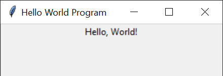

# 图形用户界面和 Tkinter

图形用户界面（Graphical User Interface，简称 GUI）是一种用户接口，允许用户通过图形图标和视觉指示符与电子设备交互，而不仅仅是文本命令行操作。创建图形用户界面需要考虑为程序增加窗口、图标、按钮、菜单、图片、文本框等各种元素，实现复杂度的确高了不少。但是图形用户界面允许用户以直观的方式与计算机进行互动，极大的便利了用户。

搭建图形用户界面，在 Python 中首先可以考虑的就是使用 Tkinter 库。这是 Python 的标准 GUI（图形用户界面）库，为 Python 提供了一个快速并且简单的方式来创建图形化的应用程序。它是 Python 内置的 GUI 库，因此使用 Python 的开发者无需安装就可以直接使用它。

Tkinter 是一个封装了 Tcl/Tk 的 Python 接口。Tcl 是一种广泛使用的脚本语言，而 Tk 是一个跨平台的 GUI 工具包。Tkinter 库使得 Python 程序员可以很容易地创建具有图形用户界面的程序，其风格能够适应运行它的操作系统，使得程序具有本地应用的外观和感觉。使用 Tkinter，可以很容易地创建窗口、按钮、文本框、输入框、滑动条等常见的 GUI 元素。这些元素被称作“窗口控件”（widgets），每个控件都可以自定义其外观和行为，同时可以相互组合来构建复杂的界面。

下面我们演示一下如何创建图形用户界面。创建图形用户界面就无法在使用基于网络的 Python 开发环境了，下面的示例程序都需要运行在读者本地的 Python 环境中。

## 创建窗口

我们可以使用 Tkinter 编写一个简单的 "Hello, World!" 程序，它创建一个新的窗口，然后在上面显示出一行文字：

```python
import tkinter as tk

# 创建一个新窗口
root = tk.Tk()

# 设置窗口标题
root.title("Hello World Program")

# 创建一个标签控件（widget），包含文本 "Hello, World!"
label = tk.Label(root, text="Hello, World!")

# 将标签控件放置到窗口上
label.pack()

# 运行事件循环，等待用户操作
root.mainloop()
```

上面这段代码首先导入了 tkinter 模块。然后，它创建了一个新的 Tkinter 窗口对象 root，并为它设置了标题。接下来，创建了一个标签控件，并将其文本设置为 "Hello, World!"。标签控件专用于显示文字。

通过调用标签的 pack() 方法，标签被添加到了窗口上，并自动配置了其大小和位置。最后，mainloop() 方法启动了 Tkinter 的事件循环，等待用户的交互操作（如点击关闭按钮）。这是 Tkinter 应用程序的标准结构。

程序运行效果如下：




## 控件的布局

在 Tkinter 中，有多种方式可以摆放控件（widgets）。最常用的布局管理器有 pack(), grid(), 和 place()。
* pack() 是最简单的布局管理器。它按照控件添加的顺序将控件们“打包”到其父容器中（在这里父容器就是窗口），控件们会自动沿着主窗口的上、下、左、右边缘堆叠。
* grid() 按照行和列的方式，摆放控制控件的位置。
* place() 则是按照输入的坐标，指定控件的精确位置。

选择哪一种布局管理器，通常取决于具体需求和界面的复杂性。在实际应用中，这三种布局管理器可以根据需要混合使用，但同一个父容器中只能选择一种布局方式。例如，可以在一个用 grid() 布局的窗口中放置一个 pack() 布局的子容器（如Frame），以此来组合使用不同的布局策略。

以下是一个示例程序，使用了不同的布局管理器来在窗口的不同位置放置多个控件：

```python
import tkinter as tk

# 创建主窗口
root = tk.Tk()
root.title('Tkinter Layout Managers')

# 计算窗口位置
window_width = 600
window_height = 400
screen_width = root.winfo_screenwidth()
screen_height = root.winfo_screenheight()
center_x = int(screen_width/2 - window_width / 2)
center_y = int(screen_height/2 - window_height / 2)

# 设置窗口大小和位置
root.geometry(f'{window_width}x{window_height}+{center_x}+{center_y}')

# Create a label and position it using pack()
label1 = tk.Label(root, text='Packed Label')
label1.pack(side='top', fill='x')

# Create a frame to use the grid manager inside
frame = tk.Frame(root, borderwidth=2, relief='sunken')
frame.pack(side='top', padx=5, pady=5)

# Create two labels inside the frame and position them using grid()
label2 = tk.Label(frame, text='Grid Label 1')
label2.grid(row=0, column=0, padx=5, pady=5)

label3 = tk.Label(frame, text='Grid Label 2')
label3.grid(row=0, column=1, padx=5, pady=5)

# Create an entry widget and position it using place()
entry = tk.Entry(root)
entry.place(x=50, y=100)

# Create a button and position it absolutely using place()
button1 = tk.Button(root, text='Placed Button')
button1.place(x=180, y=100)

# Create a button and position it relatively using place()
button2 = tk.Button(root, text='Relatively Placed Button')
button2.place(relx=0.5, rely=0.75, anchor='center')

# 运行事件循环，等待用户操作
root.mainloop()
```

在上面的程序中，首先创建了一个窗口，然后设置了窗口的尺寸，并让它在频幕上居中显示。然后又创建了几种不同的控件，包括框架（Frame）、标签、按钮（Button）和输入框（Entry），把它们摆放在了窗口不同的位置。其中，框架内部还可以摆放多个控件。

## 用户事件

图形用户界面中，最常见的用户操作是在输入框内输入文字，或点击按钮。 它通过回调函数来相应用户的操作，也就是把一些处理用户事件的函数（回调函数），与特定的用户事件绑定，一旦事件被触发，系统会自动调用对应的回调函数。

```python
import tkinter as tk

def handle_user_input():
    # 获取用户在输入框中输入的内容
    user_input = entry.get()
    
    # 将获取到的内容用于处理，这里是将其显示在标签中
    result_label.config(text=f"您输入了：{user_input}")

# 创建主窗口
root = tk.Tk()
root.title('用户输入处理示例')

# 创建一个输入框
entry = tk.Entry(root)
entry.pack(pady=10)

# 创建一个标签，用于显示结果
result_label = tk.Label(root, text="请输入内容")
result_label.pack(pady=10)

# 创建一个按钮，点击时会处理用户输入
submit_button = tk.Button(root, text="提交", command=handle_user_input)
submit_button.pack(pady=10)

# 开始Tkinter事件循环
root.mainloop()
```

运行上面的程序会弹出一个窗口，窗口中包含一个文本输入框、一个标签和一个按钮。用户输入文本后点击"提交"，输入的内容会显示在标签上。这是一个简单的用户输入处理流程。Button上显示"提交"，当用户点击按钮时，会调用handle_user_input函数。
handle_user_input函数中，entry.get()用于获取输入框的内容，然后更新result_label的text属性，将输入的文本显示出来。


我们还可以为控件的鼠标事件，绑定回调函数。比如下面的程序，会检测鼠标是否挪到了按钮控件的上方，一旦诺上去了，控件就立刻被挪到其它位置，让鼠标无法点击按钮：

```python
import tkinter as tk
import random

# 创建主窗口
root = tk.Tk()
root.geometry('600x400')  # 更大的窗口以便按钮有更多的移动空间

# 移动按钮的函数
def move_button(event):
    new_x = random.randint(0, root.winfo_width() - button.winfo_width())
    new_y = random.randint(0, root.winfo_height() - button.winfo_height())
    button.place(x=new_x, y=new_y)

# 创建一个要移动的按钮
button = tk.Button(root, text="来抓我呀！")
button.place(x=50, y=50)  # 初始位置

# 绑定鼠标进入按钮的事件到move_button函数
button.bind('<Enter>', move_button)

# 启动事件循环
root.mainloop()
```

## 简单动画

不断改变控件的位置就可以让控件动起来，就向上面那个示例程序中的按钮就是会动的。我们还可以设置一个计时器，每隔一段时间就让控件动一动，这样，控件就可以在么有用户事件的时候，自动运动：

```python
import tkinter as tk

# 创建主窗口
root = tk.Tk()
root.geometry('600x400')  # 更大的窗口以便按钮有更多的移动空间

# 创建一个要移动的按钮
button = tk.Button(root, text="来抓我呀！")
button.place(x=50, y=50)  # 初始位置

# 自动移动按钮的函数
def auto_move_button():
    # 获取当前按钮的位置
    current_x = button.winfo_x()
    current_y = button.winfo_y()

    # 更新按钮的位置
    new_x = current_x + 10
    if new_x < root.winfo_width():
        button.place(x=new_x, y=current_y)
    else:
        button.place(x=50, y=current_y)  # 如果到达边界，重新开始

    # 每隔100毫秒再次调用这个函数，创建一个循环
    root.after(100, auto_move_button)


# 在事件循环开始前调用一次函数以启动循环
root.after(100, auto_move_button)

# 启动事件循环
root.mainloop()
```


笔者最近接到儿子布置的一个任务，要求在屏幕上绘制一些可以移动的刚性小球，它们之间会碰撞反弹。用于演示初中物理中讲解的动量守恒原理。可以用类似上面示例的程序来绘制移动的小球。因为移动的不是一个控件，所以我们需要在画布（Canvas）控件上绘制小球，然后移动他。画布专用户绘图，提供了各种方法来绘制简单的线段和图形。下面的程序就是笔者最初的作业：

```python
import tkinter as tk

# 初始化主窗口
root = tk.Tk()
root.title('Bouncing Ball')
root.geometry('600x400')

# 创建一个画布
canvas = tk.Canvas(root, bg='white')
canvas.pack(fill=tk.BOTH, expand=True)

# 创建一个圆球
ball = canvas.create_oval(10, 10, 60, 60, fill='blue', outline='white')

# 设置球的移动速度
speed_x = 2
speed_y = 2


# 更新球的位置
def move_ball():
    global speed_x, speed_y

    # 获取球当前的位置
    ball_left, ball_top, ball_right, ball_bottom = canvas.coords(ball)

    # 检测是否碰到窗口边缘
    if ball_left <= 0 or ball_right >= canvas.winfo_width():
        speed_x = -speed_x  # 水平方向反弹
    if ball_top <= 0 or ball_bottom >= canvas.winfo_height():
        speed_y = -speed_y  # 垂直方向反弹

    # 移动球
    canvas.move(ball, speed_x, speed_y)

    # 通过after方法设置小球移动的时间间隔，单位是毫秒
    root.after(10, move_ball)


# 启动球的移动
move_ball()

# 开始主循环
root.mainloop()
```

运行这个程序，会发现，虽然小球按照预期移动起来了。但效果并不好，有明显的闪烁和残影。总体来说，tkinter 快速搭建常用的图形用户界面，但不适合处理动画。我们需要考虑其它方法，比如使用 [pygame](pygame)。

